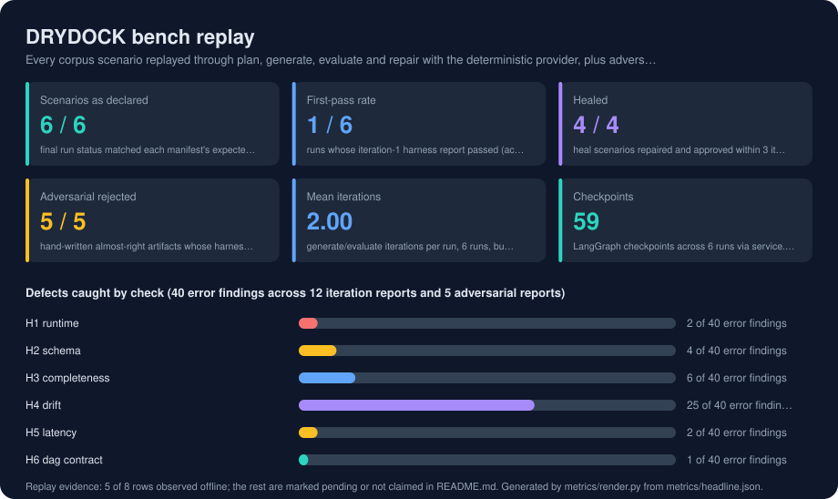
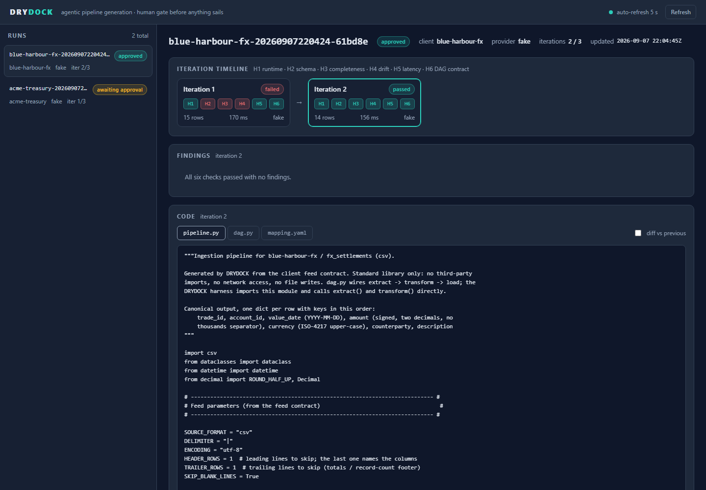

# DRYDOCK

**Agentic pipeline generation and validation harness. Client feed specs in, tested ingestion
pipelines out, and nothing sails without a signature.**

A LangGraph state machine plans, generates, sandbox-tests and repairs a data ingestion
pipeline from a client's file specification, then stops at a human approval gate. The
planner gathers evidence through MCP tools; the evaluator is a deterministic six-check
harness; the loop is bounded and every step is checkpointed and replayable.

---

## At a glance

| | |
|---|---|
| **The problem** | Client feeds are onboarded by hand: read the spec, write the pipeline, fix it, sign off in chat. |
| **What it does** | Plans via MCP tools, generates pipeline, DAG and mapping, tests, repairs, stops for a human. |
| **Stack** | Python 3.12, LangGraph, SQLite, Python `mcp` SDK, Pydantic v2, Typer, FastAPI, stub Airflow package. |
| **Validation** | ruff, mypy strict, pytest with a coverage floor, an offline seeded bench, and a card drift guard. |

The loop today is slow, its fixes are undocumented, and the sign-off leaves no evidence.
DRYDOCK parses the spec into a typed contract, gathers evidence about the samples through
MCP tools, generates `pipeline.py`, an Airflow `dag.py` and a Harbormaster-compatible
`mapping.yaml`, runs them in a sandbox against six deterministic checks, repairs on failure
up to a fixed budget, escalates when it cannot, and interrupts for a human decision before
anything is published. Every checkpoint is stored and replayable. Model backends are
swappable: Ollama and vLLM over one OpenAI-compatible adapter, Amazon Bedrock, Anthropic,
and a deterministic fake that the tests, the bench and CI use. The gate is one command
with no network, no API key and no Docker, and CI runs the same command.

<!-- metrics:start -->

## Results



Every figure below was observed by `make bench`, which runs offline with a fixed seed and no API key, and writes `metrics/headline.json`. Every corpus scenario replayed through plan, generate, evaluate and repair with the deterministic provider, plus adversarial pipelines the harness must reject. Rows marked *pending* need hardware, data or a service the offline harness does not have; nothing here is estimated.

| Metric | Value | How it was measured |
|---|---|---|
| Scenarios as declared | **6 / 6** | final run status matched each manifest's expected_outcome: pass = approved at iteration 1, heal = approved after repair, escalate = escalated at the 3-iteration budget |
| First-pass rate | **1 / 6** | runs whose iteration-1 harness report passed (acme-treasury); 4 scenarios inject a defect on purpose |
| Healed | **4 / 4** | heal scenarios repaired and approved within 3 iterations (blue-harbour-fx, kestrel-payments, northwind-custody, orion-prime) |
| Adversarial rejected | **5 / 5** | hand-written almost-right artifacts whose harness report failed on every check their expect.json says must fail |
| Mean iterations | **2.00** | generate/evaluate iterations per run, 6 runs, budget 3 |
| Checkpoints | **59** | LangGraph checkpoints across 6 runs via service.history, counting every step including each run's step -1 input checkpoint |

**Defects caught by check (40 error findings across 12 iteration reports and 5 adversarial reports)**

| | | |
|---|---|---|
| H1 runtime | `█░░░░░░░░░░░░░░░░░░░` | 2 of 40 error findings |
| H2 schema | `██░░░░░░░░░░░░░░░░░░` | 4 of 40 error findings |
| H3 completeness | `███░░░░░░░░░░░░░░░░░` | 6 of 40 error findings |
| H4 drift | `████████████░░░░░░░░` | 25 of 40 error findings |
| H5 latency | `█░░░░░░░░░░░░░░░░░░░` | 2 of 40 error findings |
| H6 dag contract | `░░░░░░░░░░░░░░░░░░░░` | 1 of 40 error findings |

**Replay evidence**

| | Status | Evidence |
|---|---|---|
| MCP tool calls made | observed | 18 over an in-memory MCP session (list_samples, peek_sample, profile_sample), recorded in each IngestionPlan.tool_calls |
| Escalations | observed | 1 of 6: meridian-legacy, spec contradicts sample |
| Artifacts published | observed | 5 clients under deploy/ (acme-treasury, blue-harbour-fx, kestrel-payments, northwind-custody, orion-prime), each with pipeline.py, dag.py, mapping.yaml and approval.json |
| Sandbox kind | observed | subprocess: python -I in a scratch directory with a minimal environment, 17 harness reports |
| Generated code lines | observed | 1689 lines across the final pipeline.py, dag.py and mapping.yaml of 6 runs |
| Live provider accuracy | pending | bench runs the deterministic fake provider only; Ollama, vLLM, Bedrock and Anthropic backends are not scored offline |
| Docker sandbox | pending | harness supports sandbox=docker (python:3.12-slim, --network none); the bench always uses subprocess so its output is identical with or without Docker |
| Airflow real import | pending | scripts/airflow_smoke.sh imports deploy/*/dag.py under real Airflow; not run by the offline bench |

<!-- metrics:end -->

## How it works



*The review dashboard on a self-heal run: iteration 1 parsed the trailer row as data and failed schema, completeness and drift; iteration 2 passed and stopped at the approval gate.*

Agents propose; the harness decides; a human disposes. The graph is a bounded state machine
rather than a free-running agent, because the loop has to be auditable, resumable across
processes and provably finite.

```
                     +----------------------------------------------------------------------------+
  corpus/<client>/   |                        DRYDOCK graph (LangGraph)
    spec.md  ----->  |  load_spec -> plan -> generate -> evaluate --+-- pass --> await_approval [interrupt]
    samples/         |                |        ^                    |                    |
    manifest.json    |                |        +-- fail, iter < N --+          +---------+---------+
                     |                |            fail, iter == N --> escalate |                   |
                     |                |                                      approve             reject
                     |                |                                         |                   |
                     |                |                                      publish        record_rejection
                     +----------------+-------------------------------------------+---------------------------+
                                      |                                           |
                               MCP tool calls                                     v
                                      v                                    deploy/<client>/
                     +-------------------------------+                     pipeline.py, dag.py,
                     | drydock-sources (MCP server)  |                     mapping.yaml, approval.json
                     |   list_samples                |
                     |   peek_sample (<= 5 rows)     |
                     |   profile_sample              |
                     +-------------------------------+

  +----------------+   +----------------------+   +----------------------+   +----------------------+
  | CLI (typer)    |   | Dashboard (FastAPI)  |   | DRYDOCK MCP server   |   | bench                |
  | build, approve |   | runs, diffs, history |   | build, inspect, sign |   | metrics/headline.json|
  +----------------+   +----------------------+   +----------------------+   +----------------------+
                     all four read and write through graph.service and graph.store
```

The Planner never receives the sample files. It asks a separate MCP server (`drydock-sources`)
for the list of samples, at most five peeked lines per sample, and a column profile, and the
names of the tools it called are recorded on the plan as evidence. The Generator emits three
files. The Evaluator copies them into a scratch directory and runs them in a fresh
interpreter, never in the orchestrator process. State is checkpointed in SQLite after every
node, keyed by `thread_id = run_id`, so a decision can arrive from another process hours
later.

The five flows the design is built around, and which the bench replays:

1. **Happy path.** `build` loads the spec, the Planner makes its three tool calls, the
   Generator renders the artifact, the Evaluator passes all six checks, and the graph
   interrupts at `await_approval`. A later `approve` resumes the checkpoint and `publish`
   writes `deploy/<client>/` with an `approval.json` naming who approved and when.
2. **Self-heal.** The first artifact parses a trailer row as data. H3 (completeness) fails
   with expected and actual row counts as evidence. The Generator runs again with the
   findings in hand, emits a repaired artifact, the Evaluator passes, and the graph
   interrupts.
3. **Escalate.** The spec says fifteen rows and the sample has fourteen. Correct code still
   fails H3, three iterations exhaust the budget, and the run ends as `escalated`. Nothing
   is published; all three reports are on disk and in the dashboard.
4. **Reject.** The reviewer rejects with a note. The run ends as `rejected`; the artifacts
   stay under `runs/<run_id>/`, nothing lands in `deploy/`.
5. **Cross-process resume.** `build` exits at the interrupt. A separate `approve` process
   opens the same SQLite file, loads the checkpoint by `run_id`, and resumes the graph with
   the decision. This is what makes the gate a gate rather than a prompt inside a loop.

## What the harness checks

Each iteration's artifact is run once per sample file inside the sandbox. The runner
imports `pipeline.py`, calls `extract` then `transform`, writes the rows to JSON, then
imports `dag.py` under a stub `airflow` package that records the declared structure. The
parent process applies six checks to what came back.

| Check | Question | Fails when |
|---|---|---|
| H1 runtime | Did it run? | Non-zero exit, timeout, no output, a traceback on stderr, or a forbidden import |
| H2 schema | Right shape? | Keys differ from the canonical columns, or a date, amount or currency breaks its rule |
| H3 completeness | Every row kept? | Row count differs from the manifest's pinned `expected_rows` |
| H4 drift | Numbers agree? | Amount total off by over half a cent, or a null rate or distinct count outside tolerance |
| H5 latency | Fast enough? | One sample exceeds the budget (default 5 s); a warning above half of it |
| H6 dag_contract | Right DAG? | `dag_id`, schedule, tasks or edges differ, import fails, or an import is off-list |

The format rules behind H2: `value_date` is `YYYY-MM-DD`, `amount` is a signed string with
exactly two decimals and no thousands separator, `currency` is three upper-case letters; the
first three offending rows are kept as evidence. The forbidden-import scan behind H1 runs
over the AST before anything executes and allows only a short stdlib list. H6's import
allowlist for `dag.py` is `DAG`, `PythonOperator`, `datetime` and `pipeline`. H3 catches
both a header or trailer counted as data and real rows dropped.

The manifest is the oracle, not a reference implementation. The corpus author's parser
builds the manifest offline; the harness never calls it at run time, so a generator cannot
pass by reproducing it.

Four hand-written adversarial pipelines live under `corpus/_adversarial/`, each with an
`expect.json` naming the check it must fail: one drops the last row (H3), one keeps the
thousands separator in amounts (H2), one imports `socket` and sleeps past the budget (H5),
one omits the `transform >> load` edge (H6). The bench counts how many the harness rejects.

## Guarantees

These are properties of the design, enforced in code and covered by tests. None of them
depends on the model being good.

- **Bounded loop.** At most `max_iterations` (default 3) generator passes per run. After
  the last failure the graph routes to `escalate` and ends. There is no path from
  `evaluate` back to `generate` once the budget is spent.
- **The human gate cannot be disabled.** `await_approval` is a LangGraph interrupt; the
  only way past it is a resume carrying `approve` or `reject` with an approver's name.
  `publish` is reachable only through `approve`. No flag, config or provider skips it.
- **Sandbox.** Generated code runs in a subprocess started with `python -I`, in a scratch
  working directory, with a minimal environment and a timeout (default 30 s per sample).
  A static AST scan rejects imports outside a stdlib allowlist and any file write before
  execution starts. An optional Docker sandbox adds `--network none`. Generated code is
  never imported into the orchestrator.
- **Data perimeter.** A real model provider sees the spec's contract block and quirks,
  per-column profiles, at most five peeked lines per sample, and on repair the previous
  artifact and the harness findings. It never sees whole sample files or anything under
  `deploy/`. The fake provider sends nothing anywhere. Details in
  [`docs/serving.md`](docs/serving.md).
- **Deterministic bench.** `drydock bench` runs the fake provider with a fixed seed against
  a fresh temporary database and writes `metrics/headline.json` with no timestamps or
  wall-clock values. The same seed produces a byte-identical file, and CI fails when the
  committed file or the rendered card drifts.

## Run it

Requires Python 3.12 and [`uv`](https://docs.astral.sh/uv/). Nothing below needs an API
key, Docker or Airflow.

```bash
uv sync
uv run drydock build acme-treasury --provider fake     # plan, generate, evaluate, stop at the gate
uv run drydock runs                                    # list runs and their status
uv run drydock show <run_id>                           # iterations, check results, findings
uv run drydock approve <run_id> --approver <name>      # resume the checkpoint; publish to deploy/
uv run drydock reject <run_id> --note "..."            # or record a rejection instead
uv run drydock replay <run_id> --step N                # graph state at checkpoint N
```

Other surfaces over the same store:

```bash
uv run drydock serve          # dashboard and JSON API on http://localhost:8787
uv run drydock mcp            # DRYDOCK as an MCP server over stdio (see docs/mcp.md)
uv run drydock bench          # replay the corpus; write metrics/headline.json
```

The whole gate, identical to CI:

```bash
uv run python scripts/check.py
```

It runs ruff, mypy strict, pytest with the coverage floor, the bench, and the two drift
checks (headline and card). `make check` wraps the same script on hosts with GNU make; the
author's Windows host has none, which is why the script is the source of truth. The
operator's view of all of this is in [`docs/runbook.md`](docs/runbook.md).

## Local or cloud models

One graph, swappable backends. `--provider fake` is the default and is what the tests and
the bench use. `ollama` and `vllm` share one OpenAI-compatible adapter for models on your
own hardware; `bedrock` and `anthropic` are thin adapters over their SDKs, installed as
optional extras. Provider configs are yaml files under `configs/providers/` and hold no
secrets; credentials come from the environment and are named in the yaml, not stored in
it. What each provider sends outside the process, how to start each backend, and how to
turn on LangSmith tracing are in [`docs/serving.md`](docs/serving.md).

## Repository map

```
drydock/
  models.py          frozen Pydantic contracts shared by everything
  paths.py, errors.py
  corpus.py          load specs, samples and pinned manifests; verify sha256
  harness/           sandbox runner, the six checks, the stub airflow package
  providers/         Provider protocol, FakeProvider, LLMProvider, backends, templates
  mcp/               sources server (the planner's tools), sync toolbox, DRYDOCK's own server
  graph/             nodes, edges, checkpointer, run store, service API
  dashboard/         FastAPI JSON API and a dependency-free HTML trace viewer
  cli.py, bench.py, events.py
corpus/              six synthetic clients and five adversarial pipelines
configs/providers/   fake, ollama, vllm, bedrock, anthropic
metrics/             render.py, card.json, headline.json (generated by the bench)
scripts/check.py     the gate
docs/design/         requirements, HLD, LLD, execution plan, decision log
docs/serving.md      provider matrix and data perimeter
docs/runbook.md      operating procedures
docs/mcp.md          registering the MCP server in a client (written at ship)
docs/ship-report.md  gate evidence, review findings, known issues (written at ship)
data/                drydock.db, created on first run (ignored by git)
runs/                per-run artifacts and events.jsonl (ignored by git)
deploy/              approved artifacts, written only by publish (ignored by git)
```

## Relationship to sibling repos

[Harbormaster](https://github.com/roshanrana/Harbormaster) decides which client and value
date an arriving file belongs to, and the `mapping.yaml` DRYDOCK generates is in its
field-mapping format, so an approved pipeline can be registered there as a client override.
[LedgerLens](https://github.com/roshanrana/LedgerLens) reconciles the rows a pipeline lands
against the ledger, one step further downstream. Neither repository is a dependency; the
shared vocabulary is the seven-column canonical schema.

## Honest limits

- The corpus is synthetic. Six clients and five adversarial cases are enough to exercise
  every branch of the graph and every check; they are not a survey of real feed formats.
- The fake provider drives the bench. It is template-driven, and its defects are declared
  per scenario in the corpus manifest. The bench measures the harness and the loop, not a
  model's ability to write pipelines.
- Live-model rows on the results card are pending. No run with Ollama, vLLM, Bedrock or
  Anthropic has been recorded, so no accuracy, cost or latency is claimed for any of them.
- Airflow is a stub. Generated DAGs are validated against a package that records structure
  at import time. Whether they load in a real scheduler is checked only by the opt-in
  `docker compose --profile airflow` target, and that result is pending until it is run.
- The canonical target schema is fixed at seven columns. Real clients would extend it.
- No multi-tenant auth on the dashboard or the MCP server. Both are local tools.

## License

MIT. See [`LICENSE`](LICENSE).
